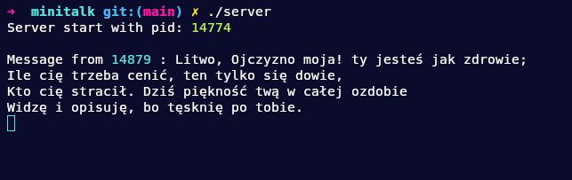
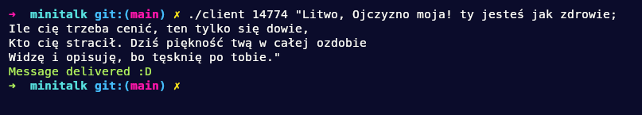

# minitalk

The purpose of this project is to code a small data exchange program using UNIX signals.

## Tehnologies

## Restrictions

- In no way your program should quit unexpectedly.
- Your program mustn’t have memory leaks.
- The server must be started first. After its launch, it has to print its PID.
- The client must send the string passed as a parameter to the server. Once the string has been received, the server must print it.
- The server has to display the string pretty quickly.
- Server should be able to receive strings from several clients in a row without
needing to restart.
- The communication between your client and your server has to be done only using
UNIX signals.
- Only use these two signals: SIGUSR1 and SIGUSR2.
- The server acknowledges every message received by sending back a signal to the
client.
- Unicode characters support.

## Screenshots

